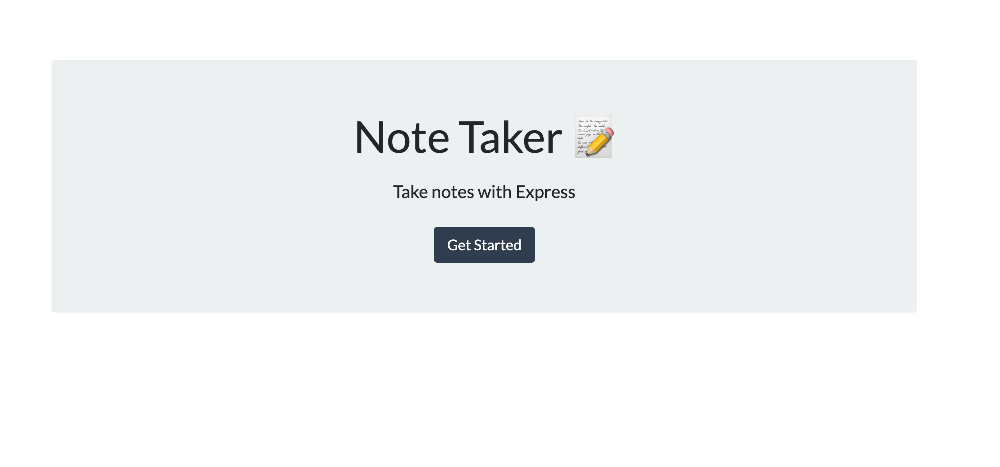
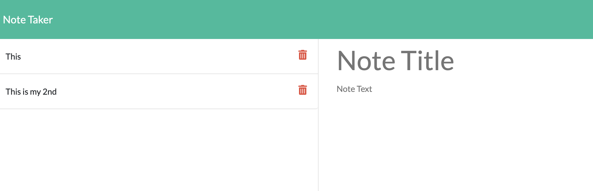

# Note_Taker
  

## Description
an application that can be used to write, save, and delete notes. This application will use an express backend and save and retrieve note data from a JSON file.

## Table of Contents
* [Description](#Description)
* [Installation](#Installation)
* [Usage](#Usage)
* [Licensing](#License)
* [Contributions](#Contributions)
* [Testing](#Tests)

## Installation

```
npm i
```

## Usage




## License
ISC

## Contributions
W3Schools, UCF Coding Bootcamp, MDN Docs, Myself

## Tests
```
N/A
```

## Questions 
You can click the following link to be taken to my GitHub profile: (http://github.com./EpicGibbon)
Feel free to check out the live website here: https://anthonysnotepad.herokuapp.com/
Feel free to reach out to me with any questions or comments: [mailto:Michant1997@gmail.com]